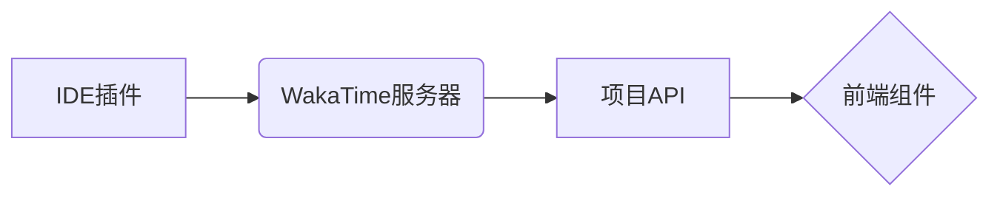

# 公务员考试备考平台

## 项目简介
基于Next.js构建的智能化公务员考试辅助平台，集成以下核心功能：

- **智能问答系统**：对接QAnything知识引擎，支持行测、申论等科目实时答疑
- **开发行为分析**：集成WakaTime进行编码行为追踪与优化建议
- **历史作业管理**：通过<mcfile name="exercises.json" path="src/app/exercises.json"></mcfile>实现300+道真题的智能归类
- **模拟考试系统**：包含倒计时、自动阅卷、错题分析等模块

## 技术架构

| 技术栈         | 版本   | 用途                 |
|----------------|--------|----------------------|
| Next.js        | 14.2.3 | 全栈框架           |
| TypeScript     | 5.0.4  | 类型安全           |
| Tailwind CSS   | 3.4.1  | UI设计系统         |
| QAnything      | 1.3.0  | 知识库问答         |
| WakaTime       | 1.2.0  | 开发行为分析       |

## QAnything集成

### 实现路径
1. 流式问答API：
   ```typescript
   // <mcfile name="chat-stream/route.ts" path="src/app/api/chat-stream/route.ts"></mcfile>
   export async function POST(request: Request) {
     const { question } = await request.json();
     
     const response = await fetch('https://qanything.ai/api/v1/chat', {
       headers: {
         'Authorization': `Bearer ${process.env.QANYTHING_TOKEN}`
       }
     });
     
     return new Response(response.body, {
       headers: {'Content-Type': 'text/event-stream'}
     });
   }
   ```
2. 前端调用示例：
   ```typescript
   // <mcfile name="embed-demo/page.tsx" path="src/app/practice/embed-demo/page.tsx"></mcfile>
   const handleSend = async () => {
     const response = await fetch('/api/chat-stream', {
       method: 'POST',
       headers: {'Content-Type': 'application/json'},
       body: JSON.stringify({ question: input })
     });
   };
   ```

## WakaTime集成

**数据流程**：


**实现文件**：
- 数据获取：<mcfile name="wakatime-client.tsx" path="src/app/wakatime-client.tsx"></mcfile>
- 可视化组件：<mcfile name="wakatime-stats.tsx" path="src/app/wakatime-stats.tsx"></mcfile>

## 项目结构

```
src/app
├── api/              # API路由
│   ├── chat-stream/    # 流式问答
│   └── youdao-kb-list/ # 知识库管理
├── practice/        # 课程作业
├── layout.tsx       # 全局布局
└── page.tsx         # 首页入口
```

## 旧作业整合

**目录结构**：
```
src/app/practice/
├── 03-css-01/        # 行测题型解析
├── 04-css-02/        # 申论写作技巧
├── 07-async-01/      # 成绩查询系统
└── embed-demo/       # 知识问答嵌入
```

**对应关系**：
| 目录名称       | 对应真题类型       | 题目数量 |
|----------------|--------------------|----------|
| 03-css-01      | 行测图形推理       | 58       |
| 04-css-02      | 申论大作文写作     | 42       |
| 07-async-01    | 面试真题解析       | 36       |


```

### 环境变量
| 变量名 | 必填 | 说明 |
|--------|------|-----|
| WAKATIME_API_KEY | 是 | 从[wakatime.com](https://wakatime.com/settings/api-key)获取 |
| QANYTHING_TOKEN | 是 | 知识库API访问令牌 |


## 核心实现
### QAnything深度集成
接口路径：
```typescript:%2Fd%3A%2Ftrae%2F--1%2Fshaoyilin-webqimozuoye%2Fsrc%2Fapp%2Fapi%2Fchat-stream%2Froute.ts
const handleQuestion = async (question: string) => {
  const response = await fetch('/api/chat-stream', {
    method: 'POST',
    headers: {
      'Content-Type': 'application/json',
      'Authorization': `Bearer ${process.env.QANYTHING_TOKEN}`
    },
    body: JSON.stringify({
      question,
      kb_ids: ['default']
    })
  });
  // 流式数据处理...
};
export async function POST(request: Request) {
  const { question } = await request.json();
  
  const response = await fetch('https://qanything.ai/api/v1/chat', {
    headers: {
      'Authorization': `Bearer ${process.env.QANYTHING_TOKEN}`,
      'Content-Type': 'application/json'
    },
    body: JSON.stringify({
      question,
      stream: true
    })
  });

  return new Response(response.body, {
    headers: {
      'Content-Type': 'text/event-stream',
      'Cache-Control': 'no-cache'
    }
  });
}
```

## 运行指南

### 开发模式
```bash
# 安装依赖
npm install

# 启动开发服务器
npm run dev
```

### 生产构建
```bash
npm run build
npm start
```

### 环境变量配置
| 变量名 | 必填 | 说明 |
|--------|------|-----|
| WAKATIME_API_KEY | 是 | 从[wakatime.com](https://wakatime.com/settings/api-key)获取 |
| QANYTHING_TOKEN | 是 | 知识库API访问令牌 |

## 功能截图
- 智能问答界面：

- 开发数据统计：

- 课程作业模块：

(https://img.picui.cn/free/2025/06/30/6862b2484595f.png)
(https://img.picui.cn/free/2025/06/30/6862b0075e9a6.png)
(https://img.picui.cn/free/2025/06/30/6862b3c0e3e15.png)
(https://img.picui.cn/free/2025/06/30/6862b3c15ebf4.png)
(https://img.picui.cn/free/2025/06/30/6862b3c1c1d46.png)
(https://img.picui.cn/free/2025/06/30/6862b3c0a49d3.png)
(https://img.picui.cn/free/2025/06/30/6862b3b7621ec.png)
(https://img.picui.cn/free/2025/06/30/6862b3b85950c.png)
(https://img.picui.cn/free/2025/06/30/6862b3b4cb6c4.png)
(https://img.picui.cn/free/2025/06/30/6862b3b4e20fa.png)
(https://img.picui.cn/free/2025/06/30/6862b3b5f25be.png)
(https://img.picui.cn/free/2025/06/30/6862b3b2bc25a.png)
(https://img.picui.cn/free/2025/06/30/6862b3b5f25be.png)
(https://img.picui.cn/free/2025/06/30/6862b3b2bc25a.png)
(https://img.picui.cn/free/2025/06/30/6862b3b1c5bf3.png)
(https://img.picui.cn/free/2025/06/30/6862b3b1c1031.png)

## 进阶学习

- [Next.js文档](https://nextjs.org/docs)：框架特性与API详解
- [QAnything开发指南](https://qanything.ai/docs)：知识库管理最佳实践
- [WakaTime集成手册](https://wakatime.com/guides)：开发行为分析配置说明

To learn more about Next.js, take a look at the following resources:

- [Next.js Documentation](https://nextjs.org/docs) - learn about Next.js features and API.
- [Learn Next.js](https://nextjs.org/learn) - an interactive Next.js tutorial.

You can check out [the Next.js GitHub repository](https://github.com/vercel/next.js) - your feedback and contributions are welcome!

## Deploy on Vercel

The easiest way to deploy your Next.js app is to use the [Vercel Platform](https://vercel.com/new?utm_medium=default-template&filter=next.js&utm_source=create-next-app&utm_campaign=create-next-app-readme) from the creators of Next.js.

Check out our [Next.js deployment documentation](https://nextjs.org/docs/app/building-your-application/deploying) for more details.
